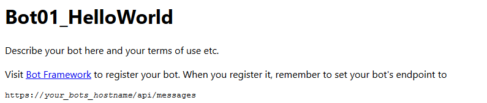
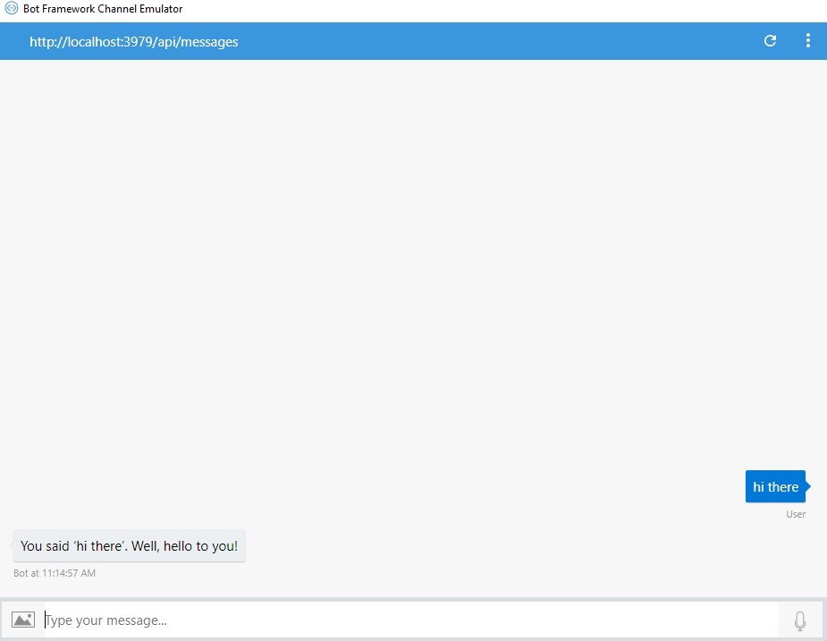

# Hello World! #
In this first example we'll put focus on two classes because both are fundamental to the basic function of our bot:
## MessagesController ##
<b>TL;DR;</b> <i>This Class contains logic to reply our user with a new dialog everytime it receives a post request that contains a Message activity type.</i>

It is the direct gate for our bot to the world. All of our users messages will arrive in the Post method:
```csharp
public async Task<HttpResponseMessage> Post([FromBody]Activity activity)
{
    if (activity.Type == ActivityTypes.Message)
    {
        await Conversation.SendAsync(activity, () => new Dialogs.RootDialog());
    }
    else
    {
        HandleSystemMessage(activity);
    }
    var response = Request.CreateResponse(HttpStatusCode.OK);
    return response;
}
```
The Post method receives an Activity object that comes from the body 
of an HTTP request to our bot endpoint. On this first sample we're checking if the activity is a Message because it could also be a ConversationUpdate, Ping or DeleteUserData activity.


In fact, our Post method calls a HandleSystemMessage method if the activity type is not a message. Although it is not implementing some logic yet:
```csharp
private Activity HandleSystemMessage(Activity message)
{
    if (message.Type == ActivityTypes.DeleteUserData)
    {
        // Implement user deletion here
        // If we handle user deletion, return a real message
    }
    else if (message.Type == ActivityTypes.ConversationUpdate)
    {
        // Handle conversation state changes, like members being added and removed
        // Use Activity.MembersAdded and Activity.MembersRemoved and Activity.Action for info
        // Not available in all channels
    }
    else if (message.Type == ActivityTypes.ContactRelationUpdate)
    {
        // Handle add/remove from contact lists
        // Activity.From + Activity.Action represent what happened
    }
    else if (message.Type == ActivityTypes.Typing)
    {
        // Handle knowing that the user is typing
    }
    else if (message.Type == ActivityTypes.Ping)
    {
    }

    return null;
}
```
> NOTE: On this sample we won't cover the handling of such activities. If you want to take a reading regarding the different type of activities that BotBuilder has, you can [check this documentation](https://docs.botframework.com/en-us/csharp/builder/sdkreference/d2/d7d/class_microsoft_1_1_bot_1_1_connector_1_1_activity_types.html).

Going back to the Post method: If our activity is a message, the code is calling is declaring a new dialog and then sending it to the user asynchronously:
```csharp
await Conversation.SendAsync(activity, () => new Dialogs.RootDialog());
```


## RootDialog ##
This class inherits the IDialog interface and therefore needs to implement the StartAsync method:
```csharp
public Task StartAsync(IDialogContext context)
{
    context.Wait(MessageReceivedAsync);

    return Task.CompletedTask;
}
```
Within the StartAsync method we're calling at a method called MessageReceivedAsync:
```csharp
private async Task MessageReceivedAsync(IDialogContext context, IAwaitable<object> result)
{
    var activity = await result as Activity;

    // return our reply to the user
    await context.PostAsync($"You said '{activity.Text}'. Well, hello to you!");

    context.Wait(MessageReceivedAsync);
}
```

## MessageReceivedAsync line by line ##
### Method parameters ###
```csharp
private async Task MessageReceivedAsync(IDialogContext context, IAwaitable<object> result)
{
    // code goes here
}
```
The method receives two parameters, although we never really 'send' those parameters when we call the method:
- IDialogContext object called Context which acts as a the dialog owner replying our user and waiting for new messages.
- IAwaitable<object> result object, that contains the activity an user sends to the bot.

### Parsing our result as an activity: ###
```csharp
var activity = await result as Activity;
```
Since the interface IAwaitable is not necessarily attached to activities we need to parse the result object as an Activity to get access to its parameters.

>NOTE: After parsing our activity, we'll write some logic to our bot to know what to do with the user's input. So most of our logic will go here: after parsing the activity and before replying to our user.

### Replying our user ###
```csharp
await context.PostAsync($"You said '{activity.Text}'. Well, hello to you!");
```
The context object has a method called 'PostAsync' which simply replies to our user. Now, this reply could be more complex and instead of just returning plain text we could define a Message object that contains images, GIFs, a set of buttons, etc, as we will learn in future samples.

### Looping the dialog ###
```csharp
context.Wait(MessageReceivedAsync);
```
Once the bot has replied to our user, it will just wait for another message to arrive by calling the MessageReceivedAsync method again. Note that first, the message will have to pass through the Post method in the MessagesController class.

## Testing the bot ##
If we press run / debug our solution in Visual Studio, a browser will open displaying the content from the default.html file:



We are going to use the Bot Emulator app to test our bots from now on. If you don't have it yet you can [download it from here](https://docs.microsoft.com/en-us/bot-framework/debug-bots-emulator).
Once you install the emulator, simply copy the localhost url and port exposed in your browser to your emulator:



