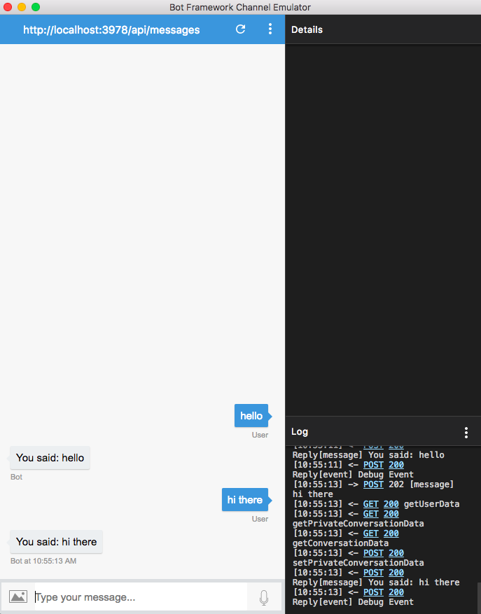

# Our second bot #
Our second bot will be published on an API endpoint to it can receive messages from different channels beyond the Console. And to do this we need to write a few more lines of code.

First, we'll install Restify to create a new server fast and easy:
```console
npm install restify
```

Now we need to call restify from our bot code, as well as calling botbuilder
```javascript
var restify = require('restify');
var botbuilder = require('botbuilder');
```
It is time to create our server and make it listen to a specific port:

```javascript
var server = restify.CreateServer();
server.listen(process.env.port || process.env.PORT || 3978, function(){
    console.log('%s listening to %s', server.name, server.url)
});
```
The server's 'listen' method receives a port number and a function. It first tries to recover a 'port' or 'PORT' attribute from the environment variables and if doesn't find them it sets the port to the hardcoded value '3978'

Our server is created and listening for messages, but before we send a response we need to define a new connector:

```javascript
var connector = new builder.ChatConnector({
    appId : process.env.MicrosoftAppID,
    appPassword : process.env.MicrosoftAppPassword
});
```
Note that this time we are not using a ConsoleConnector object but a ChatConnector one. This is because we now want to receive messages from different channes other that the console in our machines.
>TIP: For more information regarding ChatConnector <a href="https://docs.botframework.com/en-us/node/builder/chat-reference/classes/_botbuilder_d_.chatconnector.html">take a look at its documentation</a>.

Our server can post messages now that we have a connector:
```javascript
server.post('/api/messages', connector.listen());
```

Finally, our new bot can be declare in a similar fashion as our first bot:
```javascript
var bot = new builder.UniversalBot(connector,function(session){
    session.send("You said: %s", session.message.text);
});
```

## Testing time ##
Once we run 
    ```console
    node app.js
    ```
on our console we note the following message:
```javascript
restify listening to http://[::]:3978
```
If we recall our server creation and listening functions from before we notice that is now up and running on localhost:3978.

Since we are not using the ConsoleConnector we won't be able to type text on our console and expect a response. Instead we can download the Microsoft Bot Emulator <a href="https://docs.microsoft.com/en-us/bot-framework/debug-bots-emulator">from this site</a>
>TIP: The Bot Emulator is available for Windows, Mac and Linux distros so chances are you are covered.

