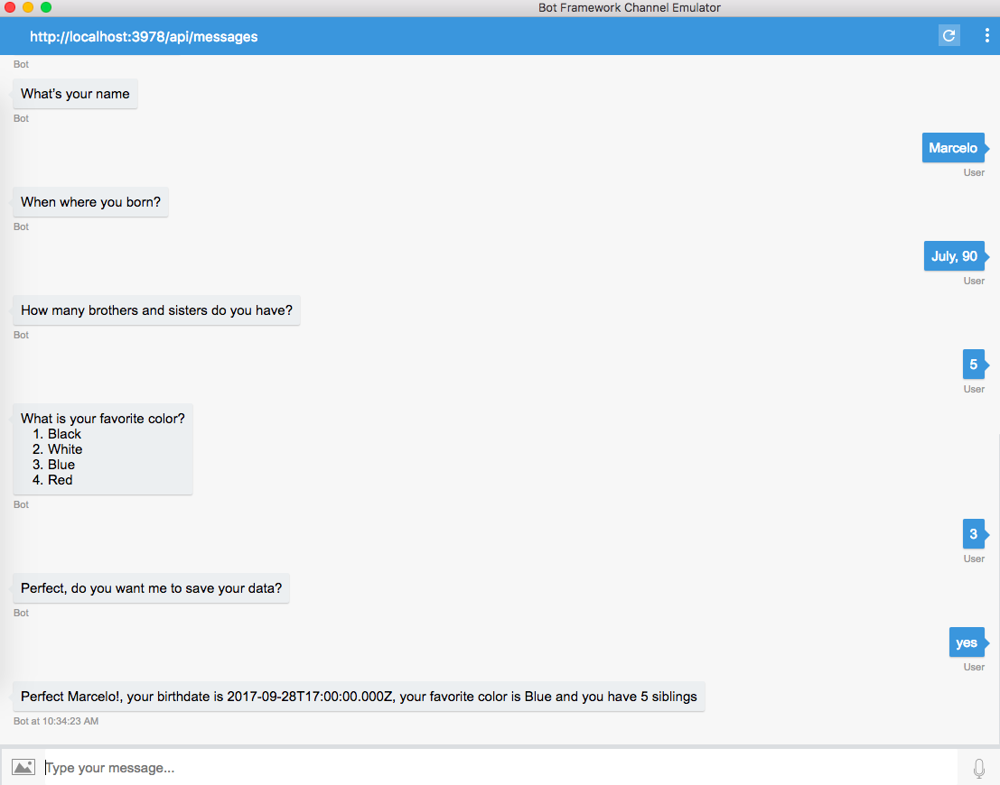

# Our fourth bot: Dialogs part 1: Waterfall #
Now that we learned how to reply to our user with more than text by using rich cards it is time to learn more about different ways to handle dialogs.

Dialogs to a bot are as screens to a traditional application. We can have a single dialog to cover all the conversation with a user. However in a more complex bot scenario, we will need to use multiple dialogs for different purposes. Suppose we have a e-commerce bot that helps the user log in, navigate through the store, check out their items and finally make a payment, in this scenario having a single dialog to handle all those interactions would result in hard to mantain code. In fact, it would be better to have the next dialogs:
- Log in dialog
- Check items from store dialog
- Check out items dialog
- Payment dialog
- Get / print receipt dialog

The Bot Builder has a dialog stack with a root dialog at the beginning, every time a new dialog is called it is added to the dialog stack and thus has the control of the conversation with the user. When that dialog ends it is removed from the stack and the previous dialog that made the initial call retrieves the control, until we go back to the root dialog or end the conversation as a whole.

> NOTE: Bot Builder has a dialog stack, us humans don't. So we should keep this in mind when designing our dialogs and try to think of ways our code should handle times when our user doesn't want to follow the conversational flow. This is a nice article on [do's and dont's for designing the bot navigation](https://docs.microsoft.com/en-us/bot-framework/bot-design-navigation)

## Waterfall navigation ##
But before going deep handling multiple dialogs let's see how Bot Builder's [waterfall](https://docs.microsoft.com/en-us/bot-framework/nodejs/bot-builder-nodejs-dialog-waterfall) can help us divide different tasks within a single dialog.

### Managing state data ###
A strong ally when handling the conversation with our ser will be the storage containers exposed in the session object, all of them have different scopes depending at the level in which we are during the conversation:
- userData, persist across multiple conversations, user scoped data saved on a specific channel
- privateConversationData, persists during the current conversation, private to the specific user
- conversationData, persist during the current conversation, shared across all the users within the conversation
- dialogData, persists across the current dialog as long as the dialog is not removed form the stack, each dialog maintains a copy of its dialogData

> TIP: You can learn more about storage containers in its [documentation](https://docs.microsoft.com/en-us/bot-framework/nodejs/bot-builder-nodejs-state)

> NOTE: While the dialog data and conversation data can be handled during the conversation lives it is not truly recommended to store persistent data using userData, there are complete tutorials on persisting data with [CosmosDB](https://docs.microsoft.com/en-us/bot-framework/nodejs/bot-builder-nodejs-state-azure-cosmosdb) or [Table storage](https://docs.microsoft.com/en-us/bot-framework/nodejs/bot-builder-nodejs-state-azure-table-storage). We'll cover those in future examples

### Prompts ###
One good thing about the Bot Builder is that is able to receive multiple types of inputs from our user. We use Prompts for this, and there are a couple of interesting options:
- Prompts.text, expects a text entered by the user
- Prompts.confirm, expects the user to confirm an action with a yes or no response
- Prompts.number, asks the number to enter a number
- Prompts.time, asks the user for a date/time and parses it using the [Chrono library](https://github.com/wanasit/chrono)
- Prompts.choice, gives the user a set of options that could vary from simple texts to an array of objects
- Prompts.attachment, expexts the user to upload an image or video

> TIP: Learn more about prompts at its [documentation here](https://docs.microsoft.com/en-us/bot-framework/nodejs/bot-builder-nodejs-dialog-prompt)

## Coding time ##
With what we've learned so far from managing state data and prompts we are ready to build a waterfall dialog.
Let's initialize our bot as usual:

```javascript
var restify = require('restify');
var builder = require('botbuilder');

var server = restify.createServer();
server.listen(process.env.port || process.env.PORT || 3978,function(){
    console.log('%s listening to %s', server.name, server.url);
});

var connector = new builder.ChatConnector({
    appId : process.env.MicrosoftAppID,
    appPassword : process.env.MicrosoftAppPassword
}); 

server.post('/api/messages', connector.listen());
```
Nothing changes here, we are required to use both restify and botbuilder, create and initialize a server and then wait for messages from the user.

Does the UniversalBot changes? Lets see:
```javascript
var bot = new builder.UniversalBot(connector,[
    function(session){

    },
    function(session,results){
        var result = results.response;
        // code goes here
    },
    // more functions here...
    function(session,results){
        // code also goes here
    }
]);
```
In fact it does. Now its second parameter is not a single function but a list of functions. The first function only receives the session as a parameter but the next functions do receive a second parameter, a 'results' object that contains whatever was sent as a response from the user in the previous function.

Requesting input from the user using prompts is as easy as writing:
```javascript
var bot = new builder.UniversalBot(connector,[
    function(session){
        session.send("Hello, welcome to our bot");
        builder.Prompts.text(session, "What's your name");
    },
    function(session,results){
        var result = results.response     
    }
]);
```

In fact, let's make use of the DialogData storage container:
```javascript
var bot = new builder.UniversalBot(connector,[
    function(session){
        session.send("Hello, welcome to our bot");
        builder.Prompts.text(session, "What's your name");
    },
    function(session,results){
         session.dialogData.userName = results.response;
    }
]);
```
Now our user's name is stored in the 'userName' attribute and can be used in future functions within this same dialog. Let's make use of different prompts:

```javascript
    var bot = new builder.UniversalBot(connector,[
    function(session){
        session.send("Hello, welcome to our bot");
        builder.Prompts.text(session, "What's your name");
    },
    function(session,results){
        session.dialogData.userName = results.response;
        builder.Prompts.time(session, 'When where you born?');
    },
    function(session,results){
        session.dialogData.userBirthDate = builder.EntityRecognizer.resolveTime([results.response]);
        builder.Prompts.number(session,"How many brothers and sisters do you have?");
    },
    function(session,results){
        session.dialogData.userNumberOfSiblings = results.response;
        builder.Prompts.choice(session,"What is your favorite color?",["Black", "White", "Blue", "Red"]);
    },
    function(session, results){
        session.dialogData.userFavoriteColor = results.response.entity;
        builder.Prompts.confirm(session,"Perfect, do you want me to save your data?",);
    },
    function(session, results){
        var userResponse = session.send;
        if(userResponse){
            session.send('Perfect %s!, your birthdate is %s, your favorite color is %s and you have %s siblings',
            session.dialogData.userName,
            session.dialogData.userBirthDate,
            session.dialogData.userFavoriteColor,
            session.dialogData.userNumberOfSiblings,
            session.dialogData.userName);
        }
        else{
            session.send("Don't worry %s, we can start again if you want", 
            session.dialogData.userName);
        }
    }
]);
```
## Testing time ##
Once we publish our bot typing 
    ```console
    node app.js
    ```
at the console we can start our Bot Emulator and take a look at the results:



>NOTE: Some prompts look different depending on the channel we're using them. Remember that the bot builder tries to render the bot experience as good as it can depending on the channel's resources.